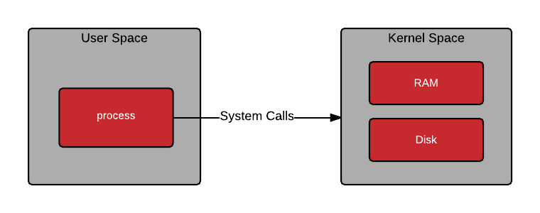

# Low-Level Foundations
Salam. Bu başlıqda C dili ilə `socket` və şəbəkə proqramlaşdırması üçün sənə lazım olacaq bəzi aşağı səviyyəli mövzuları öyrənəcəksən. Bu guidebook ilə işləyərkən əməliyyat sistemi olaraq linux və ya başqa bir unix təməlli bir şey işlətməyivi məsləhət görürəm (mənim kimi), windows istifadəçilərində kiçik fərqliliklə olsa da məntiq yenə də eynidir (bu fərqlilikləri internetdən araşdır).


## Pre-requisites
Bu guidebook dan istifadə edərkən C proqramlaşdırma dilinin fundamentallarına: `basic data types`, `structs`, `pointers`, `memory management`, `type casting` konseptlərinə hakim olmağın gözlənilir. Bu mövzular haqqında məlumatın yoxdursa, gedib ilk öncə hackerrank-dan C tapşırıqlarını işləməyini məsləhət görürəm. Yox əgər buna 'oxot'-un yoxdursa yenə də birbaşa mövzuya atıla bilərsən, əlbəttə prosesin bir az sancılı olacaq və ağlında yaranan hər sual üçün araşdırma aparmalı olacaqsan. Bunlardan savayı istədiyin linux distrosunu (əgər ağlında biri yoxdursa ubuntu-nu məsləhət görürəm) qurmağını, və ya daha da yaxşısı WSL dən istifadə etməyin yaxşı olar, windows istifadəçiləri üçün ən yaxşı yoldur.


## System Calls
Yaxşı bəs heç düşünmüsən mi necə olur ki, yazdığım və ya yazacağım proqram internetə çıxış üçün kompüterin resurslardan istifadə edir? Görəsən proqram aparat təminatına birbaşa müdaxilə edə bilir mi? Əlbəttə ki yox. Təsəvvür edin ki, yazdığınız və ciddi məntiqi xətaya sahib proqram sonsuz dövrə girir və ya icazəsiz şəkildə `memory`-ə yazmaq istəyir. Əgər bu proqram birbaşa şəbəkə kartına (NIC) və ya RAM-a müraciət edə bilsəydi, əməliyyat sistemi çökərdi. Bu səbəbdən, əməliyyat sistemi təhlükəsizlik məqsədi ilə `memory`-ni 2 hissəyə bölür (protection rings): `User-Space` və `Kernel-Space`.



### User-Space (Ring 3)
Bizim yazdığımız proqramlar (brauzerlər, oyunlar, və ya sənin yazdığın hər hansı birşey) `User-Space` də işləyir. Buradakı proseslərin imkanları məhduddur; Birbaşa `hardware`-ə toxuna bilmirlər.


### Kernel-Space (Ring 0)
Kernelin işlədiyi sahədir. Kernel bütün sistem resurslarına (CPU, RAM, Disklər, NIC) burada nəzarət edir.

Bəs yaxşı bizim bu `User-Space` proqramları şəbəkə üzərindən data göndərərkən və ya `memory`-da yer ayırarkən bunu necə edir? Bunun üçün yazdığımız `User-Space`-dakı proqram kernelin qapısını döyür və ondan bizə resurs ayırmağı üçün xahiş edir. Məhz bu proses `System Call` adlanır. Proses addım addım belə baş verir:
    1. Kodunda `socket()`, `read()`, `write()` kimi bir `System Call wrapper` işlədirsən.
    2. Proqram bu funksiyalardan birini işlədəndə CPU `User-Space` rejiminden `Kernel-Space` rejiminə keçid edir.
    3. Kernel istəyi yoxlayır, əgər hər şey qaydasındadırsa, RAM-da lazımi resursu ayırır və ya şəbəkə kartına əmr verir.
    4. İş bitdikden sonra kernel resursu RAM-da ayırıb `file descriptor`-u dərhal proqrama return edir. ve CPU yenidən `User-Space` rejiminə qayıdır.


## Everything is a File & File Descriptors (FD)
Əgər Linux əməliyyat sistemi ilə bir az vaxt keçirtmisənsə güman edirəm o məşhur "Everything in a Linux is a file" fikrini eşitmisən. Yaxşı bəs bu reallıqda nə mənaya gəlir? 


### Everything is a File
Əvvəlcə təsəvvür edək sən Linus Torvaldssan. Yazacağın əməliyyat sistemində min cür idarə etməli olduğun resurs var: diskdəki şakil faylı, klaviatura (input), monitor (output), şəbəkə kartı (Wi-Fi/Ethernet). Əgər əməliyyat sistemində bu resursları idarə etmek istəyən birisi üçün bu resursların hər birinə görə ayrı API yazsaydın, C developerinin başı xarab olardı. Fayla yazmaq üçün ayrı, NIC ilə data göndərmək üçün ayrı, ekrana data vermək üçün ayrı funksiya ilə əlləşməli olardı.

Mühəndislər dedilər ki: "Gəl bunların hamısını proqramçıya fayl kimi göstərək"

Yəni, bu o demək deyil ki, şəbəkə kartı diskdə .txt formatındakı bir fayldır. Bu o deməkdir ki, proqramçı üçün istər diskdəki fayl olsun, istərsə də şəbəkə bağlantısı - hamısı ilə işləmək eyni standart addımlardan ibarətdir:
1. Aç (`open` və ya `socket`)
2. Oxu (`read` və ya `recv`)
3. Yaz (`write` və ya `send`)
4. Bağla (`close`)


### File Descriptor (FD)
İndi təsəvvür et ki, proqramın (process) işə düşdü. Əməliyyat sistemi (Kernel) sənin proqramın üçün yaddaşda balaca bir Massiv (Array) və ya Cədvəl ayırdı. Bu cədvəlin adı `File Descriptor Table`-dır.

Bu cədvəlin indeksləri mənfi olmayan tam ədədlərdir (0, 1, 2, 3, 4...). İndekslərin içindəki xanalarda isə Kernel-in RAM-da saxladığı xüsusi resurslara göstəricilər (pointer-lər) var.

Proqram işə düşəndə bu `array`-ın ilk 3 xanası avtomatik olaraq dolur:
0. `stdin`: klaviaturanı göstərir
1. `stdout`: terminal ekranını göstərir
2. `stderr`: xətaların çıxması üçün terminal ekranın göstərir

İndi sən gedib kodunda yeni fayl açanda və ya `socket()` çağıranda:

1. Kernel RAM-da həmin şəbəkə bağlantısı üçün lazım olan `struct`-ı yaradır.
2. Sənin cədvəlinə baxır, görür ki, 0, 1, 2 artıq dolub, növbəti boş yer 3-dür.
3. 3-cü xanaya həmin şəbəkə resursunun (sözügedən `struct`-lar və s.) ünvanını (pointer) yazır.
4. Sənə (User-Space-ə) sadəcə `3` rəqəmini qaytarır. 

Məhz bu `3` rəqəmi File Descriptordur.


Zənciri birləşdirək:
Sən kodunda ```write(3, "Salam", 5)``` yazanda nə olur:
    1. Sənin C proqramın `3` rəqəmini və "Salam" sözünü götürür, `System Call` edərək Kernel-in qapısını döyür.
    2. CPU `User-Space`-dən `Kernel-Space`-ə keçir.
    3. Kernel sənin prosesinin cədvəlinə baxır: "Görəsən bunun `3` nömrəli xanasında nə var?"
    4. Görür ki, `3` nömrəli xana diskdəki fayl deyil, yaddaşda yenicə açılmış bir `socket` şəbəkə resursudur.
    5. Kernel "Salam" baytlarını götürür, şəbəkə kartına (NIC) ötürür ki, kabel/Wi-Fi ilə qarşı tərəfə göndərsin.
    6. İş bitir, CPU yenidən `User-Space`-ə qaydır.


## Socket Nədir?
Socket in nə olduğuna uzun uzadı tərif verməyə ehtiyac yoxdur. Linux əməliyyat sistemində hər şeyin fayl oldugu yəqin ki hamıya aydındır. Elə `socket` də əslində `socket()` `system call`-ı ilə `memory`-da kernel tərəfindən yaradilan şəbəkə `struct`-larını idarə etmək üçün prosesə verilən `file descriptor`-dur. Qısacası, `socket` `file descriptor`-u, `memory`-da bizim şəbəkədən istifade etməyimiz üçün yaradılmış olan `struct`-ları göstərən `pointer`-dir. Ən sadəsindən `socket`-ları şəbəkədəki iki cihazın əməliyyat sistemi səviyyəsində uc nöqtələri kimi düşünə bilərsən. İndi `socket`-in nə olduğunu ağlında tam canlandırmaqda çətinlik çəkə bilərsən. Narahat olma, növbəti mövzularda hər şey tam yerinə oturacaq.


Xülasə: Ağlında Qalmalı Olan 3 Cümlə:
Linux-da hər şey fayldır $\rightarrow$ Çünki hamısı ilə eyni read/write funksiyaları ilə danışırıq.

File Descriptor $\rightarrow$ Kernel-in sənin proqramına verdiyi balaca bir ID-dir (int rəqəmdir).

Socket $\rightarrow$ Kernel-in RAM-da saxladığı şəbəkə strukturuna verilən nəzarət rəqəmidir (FD-dir).

